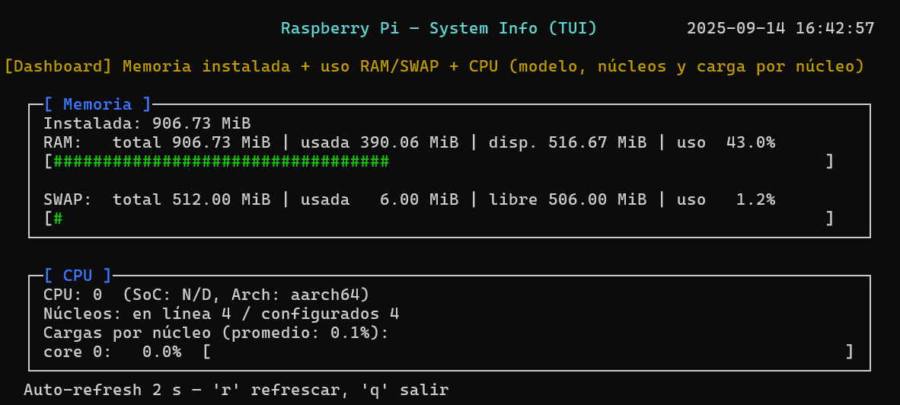

# Especificaciones del sistema
Implementación en C de un sistema sencillo que simula recursos del sistema (CPU, memoria y TUI) como parte de prácticas de Linux Embebido.

## Tabla de contenidos
- [Requisitos](#requisitos)
- [Build](#build)
- [Estructura del proyecto](#estructura-del-proyecto)
- [Ejemplo de ejecución](#ejemplo-de-ejecución)
- [Captura del sistema](#captura-del-sistema)
- [Autores](#autores)


## Requisitos
- Linux (probado en Raspberry Pi OS / Debian)
- `build-essential`
- `libncurses5-dev`
- `make`

## Build
```bash
sudo apt update
sudo apt install -y build-essential libncurses5-dev
make run   # compila y ejecuta
```
## Ejemplo de ejecución
```bash
./build/rpi-sysinfo-tui
```

## Estructura del proyecto

```ASCII
SystemResources/
├── include/          # Headers (cpu.h, memory.h, tui.h)
├── src/              # Código fuente en C
├── img/              # Capturas e imágenes para documentación
├── Makefile          # Script de compilación
└── README.md         # Documentación del módulo
```

## Captura del sistema




## Autores

**Brayan Avendaño Mesa**
- [@bavendanom](https://www.github.com/bavendanom)
- Curso (Programación de Sistemas Linux Embebidos - Universidad Nacional de Colombia)
- 2025-2
